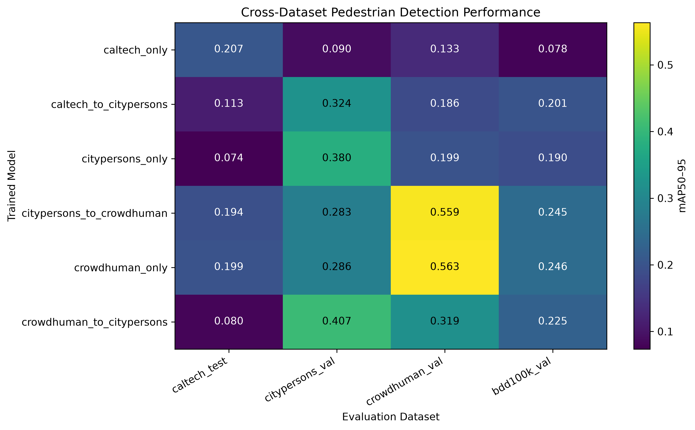
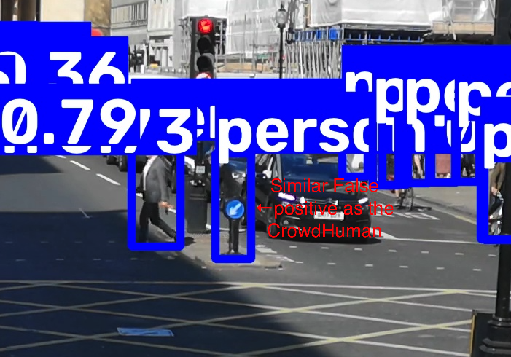
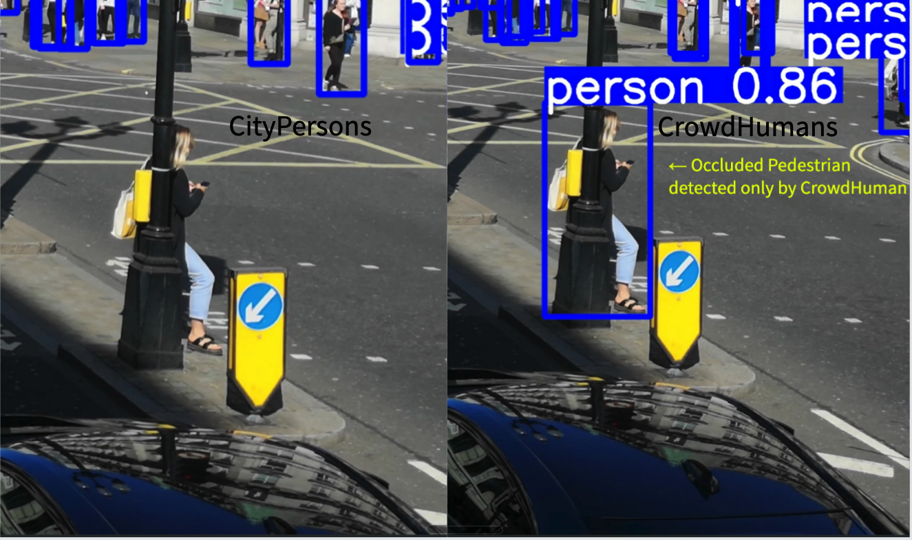

# Pedestrian Detection Across Domains with YOLOv8m

A controlled study of how **training domain and sequential fine-tuning affect cross-domain pedestrian-detection performance** using single-class YOLOv8m detectors.

The project compares models trained on **Caltech, CityPersons, and CrowdHuman**, evaluates all training strategies across multiple pedestrian domains, and uses **BDD100K as a common external evaluation dataset**.

## Highlights

* Trained and compared **6 YOLOv8m pedestrian detectors** across single-dataset and sequential-transfer strategies.
* Performed **24 model–dataset evaluations** across Caltech, CityPersons, CrowdHuman, and BDD100K.
* Found strong evidence of **training-domain specialization**, particularly for the Caltech-only detector.
* CrowdHuman-only produced the strongest overall off-domain performance among the single-dataset models and the highest result on independent BDD100K evaluation.
* CityPersons → CrowdHuman became nearly indistinguishable from CrowdHuman-only, suggesting strong influence from the final CrowdHuman training stage.
* CrowdHuman → CityPersons retained some CrowdHuman-associated behavior while adapting toward CityPersons, demonstrating that **transfer direction matters**.
* Qualitative inspection showed differences in occlusion handling, distant-pedestrian detection, recall behavior, and false positives.

### Detailed Documentation

* [Model inventory and training strategies](models/README.md)
* [Cross-dataset evaluation](cross_dataset_validation/README.md)
* [Qualitative analysis](qualitative/README.md)

---

# Research Question

> **How does the choice of training dataset affect cross-domain performance in pedestrian detection?**

The experiments additionally investigate:

1. How strongly single-dataset models specialize to their training domain.
2. Whether broader pedestrian training exposure is associated with stronger cross-domain robustness.
3. How sequential training compares with training only on the final dataset.
4. Whether the **direction of sequential fine-tuning** changes final model behavior.
5. How much earlier-domain behavior is retained after fine-tuning on a second dataset.
6. Which training strategy generalizes most effectively to a common unseen domain.
7. How domain shift affects precision, recall, and qualitative failure behavior.

---

# Experimental Design

All experiments use **YOLOv8m** as a single-class pedestrian detector.

Three models were trained independently:

* **Caltech only**
* **CityPersons only**
* **CrowdHuman only**

Three additional models used sequential fine-tuning:

* **Caltech → CityPersons**
* **CityPersons → CrowdHuman**
* **CrowdHuman → CityPersons**

Each model was then evaluated on:

* **Caltech Test**
* **CityPersons Validation**
* **CrowdHuman Validation**
* **BDD100K Validation**

This produced:

**6 models × 4 evaluation domains = 24 evaluations**

BDD100K was not used in any of the project training sequences and therefore serves as a common external domain for comparing model generalization.

---

# Cross-Dataset Results

The primary comparison metric is **mAP50–95**.

| Model                        | Caltech Test | CityPersons Val | CrowdHuman Val | BDD100K Val |
| ---------------------------- | -----------: | --------------: | -------------: | ----------: |
| **Caltech only**             |    **0.207** |           0.090 |          0.133 |       0.078 |
| **Caltech → CityPersons**    |        0.113 |           0.324 |          0.186 |       0.201 |
| **CityPersons only**         |        0.074 |           0.380 |          0.199 |       0.190 |
| **CityPersons → CrowdHuman** |        0.194 |           0.283 |          0.559 |       0.245 |
| **CrowdHuman only**          |        0.199 |           0.286 |      **0.563** |   **0.246** |
| **CrowdHuman → CityPersons** |        0.080 |       **0.407** |          0.319 |       0.225 |

## Cross-Dataset Performance



The heatmap highlights substantial domain dependence. No single training strategy dominates every evaluation dataset, but several consistent patterns emerge.

---

# Key Findings

## 1. Strong In-Domain Performance Does Not Guarantee Generalization

The **Caltech-only** detector achieved the highest mAP50–95 on Caltech Test:

```text
Caltech Test       0.207
CityPersons Val    0.090
CrowdHuman Val     0.133
BDD100K Val        0.078
```

Its performance deteriorated sharply outside the Caltech domain and reached the lowest result of all six models on BDD100K.

Under this experimental setup, Caltech therefore provides the clearest example of **source-domain specialization**.

---

## 2. CrowdHuman Produced the Strongest Overall Single-Dataset Generalization

The CrowdHuman-only detector achieved:

```text
Caltech Test       0.199
CityPersons Val    0.286
CrowdHuman Val     0.563
BDD100K Val        0.246
```

Although it did not rank first on every dataset, it remained competitive across multiple domains and achieved the strongest independent BDD100K result.

This suggests that the pedestrian variation represented by CrowdHuman was associated with stronger cross-domain robustness under the training setup used here.

Dataset diversity itself was not experimentally isolated from other factors such as dataset scale, pedestrian density, annotation characteristics, and scene composition, so this should not be interpreted as a causal conclusion about diversity alone.

---

## 3. CityPersons → CrowdHuman Converged Toward CrowdHuman-Only Behavior

CityPersons → CrowdHuman and CrowdHuman-only produced nearly identical results:

| Evaluation Domain      | CrowdHuman Only | CityPersons → CrowdHuman |
| ---------------------- | --------------: | -----------------------: |
| Caltech Test           |           0.199 |                    0.194 |
| CityPersons Validation |           0.286 |                    0.283 |
| CrowdHuman Validation  |           0.563 |                    0.559 |
| BDD100K Validation     |           0.246 |                    0.245 |

The similarity also appeared during qualitative inspection, including instances where the two detectors reproduced similar detection behavior and even the same false-positive tendency in a selected scene.



Taken together, these results suggest that **the later CrowdHuman stage largely dominated the earlier CityPersons stage under this training configuration**.

This does not establish that smaller-to-larger sequential training is ineffective in general.

---

## 4. Transfer Direction Matters

The reverse training sequence behaved differently.

On CityPersons validation:

| Model                        |  mAP50–95 |
| ---------------------------- | --------: |
| CityPersons only             |     0.380 |
| **CrowdHuman → CityPersons** | **0.407** |

CrowdHuman → CityPersons also retained stronger performance than CityPersons-only on CrowdHuman and BDD100K:

| Evaluation Domain     | CityPersons Only | CrowdHuman → CityPersons |
| --------------------- | ---------------: | -----------------------: |
| CrowdHuman Validation |            0.199 |                **0.319** |
| BDD100K Validation    |            0.190 |                **0.225** |

Qualitatively, the sequential detector showed some CrowdHuman-like behavior, including additional detections and improved handling of some occluded pedestrians, while also developing failure patterns similar to CityPersons-only.

This suggests **partial retention of earlier-domain behavior alongside adaptation toward the final training domain**.

[See the detailed transfer comparison →](qualitative/README.md)

---

# Qualitative Analysis

Quantitative metrics describe aggregate detector behavior, but they do not always reveal **which types of pedestrian instances are being detected or missed**.

Three common video frames were therefore inspected across the models at **2 s, 7 s, and 22 s**.

The selected cases include:

* distant pedestrians;
* partially occluded pedestrians;
* clear missed detections;
* differences in apparent recall;
* and false positives.

## Occlusion Example



In this example, CrowdHuman-only detects a pedestrian substantially obscured by a streetlight pole, while CityPersons-only misses the instance.

Other selected scenes showed similar differences in difficult pedestrian detections.

CrowdHuman's greater sensitivity was not universally beneficial: a separate selected example also records a false-positive pedestrian detection on a street fixture.

These examples are **illustrative rather than statistical evidence**. The quantitative conclusions of the project are based on the complete cross-dataset evaluation.

[View the full qualitative analysis →](qualitative/README.md)

---

# Selected Model

The **CrowdHuman-only YOLOv8m** detector was selected as the primary model for downstream work.

The selection was based on its overall cross-domain behavior rather than its source-domain score alone.

In particular, it:

* achieved the highest CrowdHuman validation result;
* achieved the highest independent BDD100K mAP50–95;
* remained competitive on Caltech;
* and showed qualitatively stronger handling of several difficult pedestrian cases.

The selected detector was subsequently used for downstream edge-deployment and optimization experiments maintained separately from this training/generalization repository.

---

# Repository Structure

```text
pedestrian-detection-yolov8/
├── README.md
├── LICENSE
├── requirements.txt
│
├── analysis/
│   ├── figures/
│   └── summary_tables/
│
├── models/
│   ├── README.md
│   ├── single_dataset/
│   └── transfer/
│
├── cross_dataset_validation/
│   ├── README.md
│   ├── combined_validation_summary.csv
│   ├── caltech_test/
│   ├── citypersons_val/
│   ├── crowdhuman_val/
│   └── bdd100k_val/
│
├── qualitative/
│   ├── README.md
│   ├── frames/
│   ├── selected/
│   ├── single_dataset_predictions/
│   └── transfer_predictions/
│
└── scripts/
    └── visualization/
```

### `models/`

Contains model-training metadata, configurations, training curves, samples, and the provenance of the six evaluated model variants.

[Model documentation →](models/README.md)

### `cross_dataset_validation/`

Contains all 24 model–dataset evaluation runs, individual evaluation artifacts, the combined quantitative results, and detailed interpretation.

[Cross-dataset evaluation →](cross_dataset_validation/README.md)

### `qualitative/`

Contains common source frames, unedited model predictions, curated comparisons, and qualitative interpretation of model behavior.

[Qualitative analysis →](qualitative/README.md)

### `analysis/`

Contains derived summary tables and the visualizations used to compare model performance across domains.

---

# Evaluation Protocol

Cross-dataset evaluations were performed using:

| Parameter            | Value |
| -------------------- | ----: |
| Image size           |   768 |
| Batch size           |    16 |
| Confidence threshold | 0.001 |
| NMS IoU threshold    |   0.7 |
| Maximum detections   |   300 |

Recorded metrics include:

* Precision
* Recall
* F1
* mAP50
* mAP75
* mAP50–95
* Preprocessing time
* Inference time
* Postprocessing time

For this study, accuracy and generalization metrics are the primary focus. Hardware-specific deployment performance is evaluated separately.

---

# Environment

Install the Python dependencies used by the included analysis and model workflows:

```bash
python3 -m venv .venv
source .venv/bin/activate
python -m pip install -r requirements.txt
```

Exact training configurations for individual experiments are preserved alongside the corresponding models in [`models/`](models/).

Model weight files and source datasets are excluded from the Git repository. Training metadata, metrics, figures, and evaluation artifacts are retained to preserve experiment provenance.

---

# Data and Qualitative Video

The project uses pedestrian data from:

* Caltech Pedestrian Dataset
* CityPersons
* CrowdHuman
* BDD100K

The qualitative comparison uses an external urban street video from Pexels:

[**People and Vehicles on the Streets during Daytime**](https://www.pexels.com/video/people-and-vehicles-on-the-streets-during-daytime-2954065/)

The Pexels footage was used only for qualitative inspection and was not part of the project training or quantitative evaluation datasets.

---

# Limitations

The conclusions in this repository are specific to:

* YOLOv8m;
* the preprocessing used in this project;
* the chosen training configuration;
* the selected dataset splits;
* the six training strategies evaluated;
* and the reported evaluation protocol.

The experiments do not establish universal conclusions about transfer learning or pedestrian-detection datasets.

In particular:

* dataset scale, annotation style, scene composition, and pedestrian density differ between datasets and were not independently controlled;
* the CityPersons → CrowdHuman result should be interpreted as CrowdHuman dominating the earlier training stage **under this setup**, not as proof that sequential training cannot help in other configurations;
* qualitative examples are deliberately selected to illustrate observed behaviors and should not be treated as statistical evidence.

---

# Project Summary

The experiments demonstrate that **pedestrian-detection generalization is strongly dependent on training domain**.

CrowdHuman-based training produced the strongest overall cross-domain behavior in this study, while Caltech-only exhibited substantial source-domain specialization. Sequential fine-tuning produced different outcomes depending on direction: CityPersons → CrowdHuman converged toward CrowdHuman-only behavior, while CrowdHuman → CityPersons retained some earlier-domain robustness while adapting toward CityPersons.

Together, the results emphasize that selecting a pedestrian-detection training strategy requires considering **where a detector will ultimately be deployed**, rather than relying on in-domain validation performance alone.

# References and Resources

## Datasets and Benchmarks

1. **Caltech Pedestrian Dataset**  
   P. Dollár, C. Wojek, B. Schiele, and P. Perona,  
   *“Pedestrian Detection: A Benchmark,”*  
   IEEE Conference on Computer Vision and Pattern Recognition (CVPR), 2009.  
   [Paper / Dataset Reference](https://doi.org/10.1109/CVPR.2009.5206631)

2. **CityPersons**  
   S. Zhang, R. Benenson, and B. Schiele,  
   *“CityPersons: A Diverse Dataset for Pedestrian Detection,”*  
   IEEE Conference on Computer Vision and Pattern Recognition (CVPR), 2017.  
   [Paper](https://openaccess.thecvf.com/content_cvpr_2017/html/Zhang_CityPersons_A_Diverse_CVPR_2017_paper.html)

3. **Cityscapes**  
   M. Cordts, M. Omran, S. Ramos, T. Rehfeld, M. Enzweiler, R. Benenson,
   U. Franke, S. Roth, and B. Schiele,  
   *“The Cityscapes Dataset for Semantic Urban Scene Understanding,”*  
   IEEE Conference on Computer Vision and Pattern Recognition (CVPR), 2016.  
   [Dataset / Citation](https://www.cityscapes-dataset.com/citation/)

   CityPersons provides pedestrian annotations on images from the Cityscapes dataset.

4. **CrowdHuman**  
   S. Shao, Z. Zhao, B. Li, T. Xiao, G. Yu, X. Zhang, and J. Sun,  
   *“CrowdHuman: A Benchmark for Detecting Human in a Crowd,”* 2018.  
   [Paper](https://arxiv.org/abs/1805.00123)

5. **BDD100K**  
   F. Yu, H. Chen, X. Wang, W. Xian, Y. Chen, F. Liu, V. Madhavan,
   and T. Darrell,  
   *“BDD100K: A Diverse Driving Dataset for Heterogeneous Multitask Learning,”*  
   IEEE/CVF Conference on Computer Vision and Pattern Recognition (CVPR), 2020.  
   [Paper](https://openaccess.thecvf.com/content_CVPR_2020/html/Yu_BDD100K_A_Diverse_Driving_Dataset_for_Heterogeneous_Multitask_Learning_CVPR_2020_paper.html)

6. **Microsoft COCO**  
   T.-Y. Lin, M. Maire, S. Belongie, L. Bourdev, R. Girshick, J. Hays,
   P. Perona, D. Ramanan, C. L. Zitnick, and P. Dollár,  
   *“Microsoft COCO: Common Objects in Context,”*  
   European Conference on Computer Vision (ECCV), 2014.  
   [Paper](https://arxiv.org/abs/1405.0312)

   COCO-pretrained Ultralytics YOLOv8m weights were used as the initial
   pretrained detector before pedestrian-specific fine-tuning.

---

## Model and Framework

7. **Ultralytics YOLOv8**  
   G. Jocher, A. Chaurasia, and J. Qiu,  
   *Ultralytics YOLOv8*, 2023.  
   [YOLOv8 Documentation](https://docs.ultralytics.com/models/yolov8/) ·
   [Ultralytics Repository](https://github.com/ultralytics/ultralytics)

8. **PyTorch**  
   PyTorch was used as the underlying deep-learning framework for model
   training and inference.  
   [PyTorch](https://pytorch.org/)

---

## Source Video

The qualitative analysis uses an external urban street video from Pexels:

[People and Vehicles on the Streets during Daytime](https://www.pexels.com/video/people-and-vehicles-on-the-streets-during-daytime-2954065/)

The video was used only for qualitative model inspection and was not part of the project training or evaluation datasets.

---

## License

This project's original code is released under the [MIT License](LICENSE).
Third-party datasets, pretrained models, and media remain subject to their
respective licenses and terms of use.

***