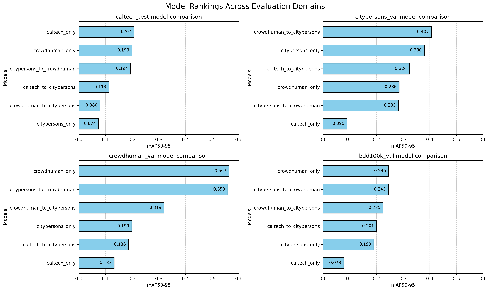
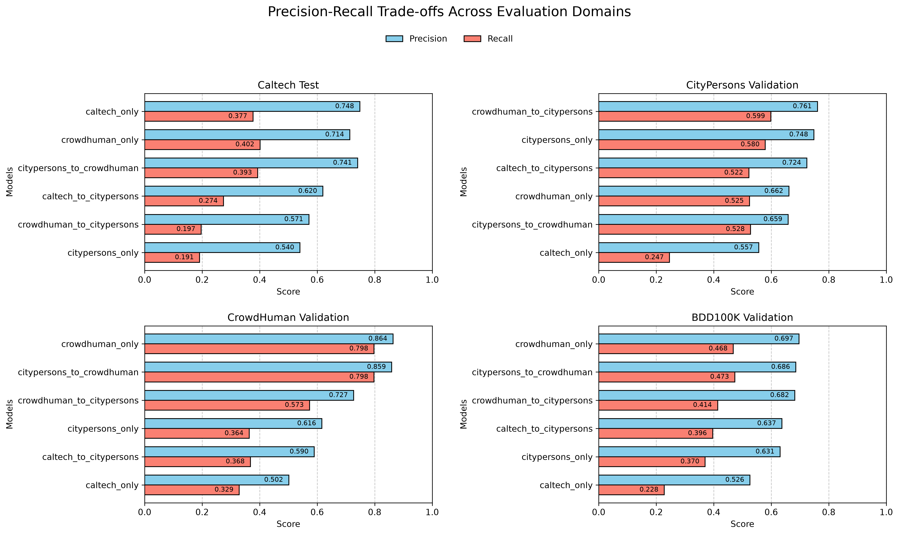

# Cross-Dataset Evaluation

This directory contains the cross-dataset evaluation of six YOLOv8m pedestrian-detection models across four evaluation domains.

The goal of this stage was to investigate how **training domain, dataset diversity, and sequential fine-tuning affect pedestrian-detection generalization across different domains**.

A total of **24 model–dataset evaluations** were performed:

* 6 trained models
* 4 evaluation datasets
* identical evaluation settings for each model within the comparison

The complete numerical results are available in [`combined_validation_summary.csv`](combined_validation_summary.csv).

---

## Research Questions

### Main Question

> **How does the choice of training dataset affect cross-domain performance in pedestrian detection?**

The evaluation was organized around several related questions:

1. **Domain specialization**
   How well do models trained on a single pedestrian dataset generalize beyond their original training domain?

2. **Dataset diversity**
   Does training on a broader and more diverse pedestrian dataset result in stronger cross-domain robustness?

3. **Sequential training**
   How does sequential training on two pedestrian datasets compare with training only on the final dataset?

4. **Transfer direction**
   Does the order of datasets in sequential training affect target-domain performance and cross-domain generalization?

5. **Knowledge retention**
   After fine-tuning on a second domain, how much performance associated with the earlier training domain is retained?

6. **Independent generalization**
   Which training strategy generalizes most effectively to BDD100K, a dataset not used during model training?

7. **Precision–recall behavior under domain shift**
   When performance deteriorates on another domain, how are precision and recall affected?

---

## Evaluated Models

Three models were trained independently on a single dataset:

* **Caltech only**
* **CityPersons only**
* **CrowdHuman only**

Three additional models used sequential training:

* **Caltech → CityPersons**
* **CityPersons → CrowdHuman**
* **CrowdHuman → CityPersons**

Additional information about the training strategy and provenance of each model is available in [`../models/README.md`](../models/README.md).

---

## Evaluation Datasets

Each model was evaluated on the same four pedestrian domains.

### Caltech Test

The held-out Caltech test split was used to evaluate performance on the Caltech domain.

### CityPersons Validation

The CityPersons validation split was used to measure performance on the CityPersons urban pedestrian domain.

### CrowdHuman Validation

The CrowdHuman validation split was used to evaluate performance in a substantially denser pedestrian environment.

### BDD100K Validation

BDD100K was used as an **independent external evaluation domain**.

None of the six evaluated models were trained on BDD100K, making this comparison particularly useful for examining generalization to a common unseen dataset.

---

## Evaluation Design

Each of the **six trained models** was evaluated on all **four evaluation domains**, producing **24 model–dataset evaluations** in total.

**Evaluation domains:**
- Caltech Test
- CityPersons Validation
- CrowdHuman Validation
- BDD100K Validation

**Models evaluated:**
- Caltech only
- CityPersons only
- CrowdHuman only
- Caltech → CityPersons
- CityPersons → CrowdHuman
- CrowdHuman → CityPersons

**Total:** 6 models × 4 domains = **24 evaluations**

---

## Evaluation Protocol

The recorded evaluations used the following settings:

| Parameter            | Value |
| -------------------- | ----: |
| Image size           |   768 |
| Batch size           |    16 |
| Confidence threshold | 0.001 |
| NMS IoU threshold    |   0.7 |
| Maximum detections   |   300 |

The primary metric used for cross-model comparison is **mAP50–95**, which evaluates detection performance across IoU thresholds from 0.50 to 0.95.

The summary CSV additionally records:

* Precision
* Recall
* F1 score
* mAP50
* mAP75
* mAP50–95
* Preprocessing time
* Inference time
* Postprocessing time
* Runtime

Timing measurements in this directory are retained as experimental records but are not used as the primary basis for model selection. Edge-performance benchmarking is treated separately from the cross-domain accuracy study.

---

# Results

## Cross-Dataset mAP50–95

The following matrix summarizes mAP50–95 for every model and evaluation domain.

| Model                        | Caltech Test | CityPersons Val | CrowdHuman Val | BDD100K Val |
| ---------------------------- | -----------: | --------------: | -------------: | ----------: |
| **Caltech only**             |    **0.207** |           0.090 |          0.133 |       0.078 |
| **Caltech → CityPersons**    |        0.113 |           0.324 |          0.186 |       0.201 |
| **CityPersons only**         |        0.074 |           0.380 |          0.199 |       0.190 |
| **CityPersons → CrowdHuman** |        0.194 |           0.283 |          0.559 |       0.245 |
| **CrowdHuman only**          |        0.199 |           0.286 |      **0.563** |   **0.246** |
| **CrowdHuman → CityPersons** |        0.080 |       **0.407** |          0.319 |       0.225 |

### Cross-Dataset Performance Heatmap


The heatmap provides the clearest overall view of how strongly model behavior changes across evaluation domains.

---

## Model Rankings by Evaluation Domain



Ranking the models independently on each domain highlights several different forms of specialization.

* **Caltech only** achieved the highest mAP50–95 on Caltech test.
* **CrowdHuman → CityPersons** achieved the highest result on CityPersons validation.
* **CrowdHuman only** achieved the highest result on CrowdHuman validation.
* **CrowdHuman only** also achieved the highest result on the independent BDD100K validation set, narrowly exceeding CityPersons → CrowdHuman.

No single training strategy dominated every evaluation domain.

---

## Precision and Recall Across Domains



The precision–recall comparison provides additional information about how model behavior changes under domain shift.

For example, on BDD100K:

| Model                    | Precision |    Recall |
| ------------------------ | --------: | --------: |
| Caltech only             |     0.526 |     0.228 |
| CityPersons only         |     0.631 |     0.370 |
| CrowdHuman only          | **0.697** |     0.468 |
| Caltech → CityPersons    |     0.637 |     0.396 |
| CityPersons → CrowdHuman |     0.686 | **0.473** |
| CrowdHuman → CityPersons |     0.682 |     0.414 |

The Caltech-only model retained moderate precision on BDD100K while recall dropped substantially, indicating that its cross-domain degradation involved a large increase in missed pedestrians rather than an equal deterioration in both metrics.

---

# Key Findings

## 1. Training Domain Strongly Affects Generalization

The results show substantial differences between in-domain and cross-domain performance.

The clearest example is the Caltech-only model:

| Evaluation Domain      |  mAP50–95 |
| ---------------------- | --------: |
| Caltech Test           | **0.207** |
| CityPersons Validation |     0.090 |
| CrowdHuman Validation  |     0.133 |
| BDD100K Validation     |     0.078 |

Caltech-only achieved the highest result on its own evaluation domain but produced the lowest BDD100K result and substantially weaker performance on CityPersons and CrowdHuman.

Under this experimental setup, the model therefore exhibited strong **source-domain specialization**.

---

## 2. CrowdHuman Training Produced the Strongest Overall Off-Domain Generalization Among the Single-Dataset Models

The CrowdHuman-only model achieved:

| Evaluation Domain      |  mAP50–95 |
| ---------------------- | --------: |
| Caltech Test           |     0.199 |
| CityPersons Validation |     0.286 |
| CrowdHuman Validation  | **0.563** |
| BDD100K Validation     | **0.246** |

Although it did not achieve the highest score on every dataset, CrowdHuman-only remained competitive across multiple domains and produced the strongest independent BDD100K result.

These results are consistent with the hypothesis that training on a more varied pedestrian domain can improve robustness to domain shift.

However, the experiment does not isolate dataset diversity from other differences between the datasets, such as dataset size, annotation characteristics, scene composition, or pedestrian density. The results therefore support an association rather than establishing dataset diversity alone as the cause.

---

## 3. CityPersons → CrowdHuman Closely Matched CrowdHuman-Only

One of the strongest observations from the sequential-training experiments was the similarity between:

* **CrowdHuman only**
* **CityPersons → CrowdHuman**

Their results were:

| Evaluation Domain      | CrowdHuman Only | CityPersons → CrowdHuman |
| ---------------------- | --------------: | -----------------------: |
| Caltech Test           |           0.199 |                    0.194 |
| CityPersons Validation |           0.286 |                    0.283 |
| CrowdHuman Validation  |           0.563 |                    0.559 |
| BDD100K Validation     |           0.246 |                    0.245 |

The models were nearly identical across all four evaluation domains.

Under this training setup, the later CrowdHuman training stage therefore appears to have **dominated the earlier CityPersons stage**, leaving little measurable difference from training on CrowdHuman alone.

This result should **not** be interpreted as evidence that sequential training is ineffective in general.

---

## 4. Transfer Behavior Depends on Training Direction

The reverse sequence produced a noticeably different result.

On CityPersons validation:

```text
CityPersons only           0.380
CrowdHuman → CityPersons   0.407
```

CrowdHuman → CityPersons outperformed CityPersons-only on the final CityPersons domain.

It also retained stronger performance than CityPersons-only on CrowdHuman and BDD100K:

| Evaluation Domain     | CityPersons Only | CrowdHuman → CityPersons |
| --------------------- | ---------------: | -----------------------: |
| CrowdHuman Validation |            0.199 |                **0.319** |
| BDD100K Validation    |            0.190 |                **0.225** |

By contrast, Caltech → CityPersons achieved `0.324` mAP50–95 on CityPersons validation, below the `0.380` obtained by CityPersons-only.

The sequential-training results therefore do not support a simple conclusion that prior training is always beneficial or always irrelevant.

Instead, **the source dataset and the order of fine-tuning both matter under this experimental setup**.

---

## 5. Earlier-Domain Performance Can Be Partially Retained After Fine-Tuning

The CrowdHuman → CityPersons model provides evidence that sequential fine-tuning does not necessarily erase all characteristics associated with the earlier training domain.

After CityPersons fine-tuning, the model achieved:

* `0.407` mAP50–95 on CityPersons
* `0.319` on CrowdHuman
* `0.225` on BDD100K

Compared with CityPersons-only, this represents both stronger target-domain performance and improved performance on CrowdHuman and BDD100K.

The amount of retained performance nevertheless depended strongly on the training sequence, as demonstrated by the contrasting CityPersons → CrowdHuman results.

---

## 6. CrowdHuman-Based Training Generalized Best to BDD100K

BDD100K provides the clearest common unseen domain because none of the evaluated models were trained on it.

The BDD100K mAP50–95 ranking was:

| Rank | Model                    |  mAP50–95 |
| ---: | ------------------------ | --------: |
|    1 | **CrowdHuman only**      | **0.246** |
|    2 | CityPersons → CrowdHuman |     0.245 |
|    3 | CrowdHuman → CityPersons |     0.225 |
|    4 | Caltech → CityPersons    |     0.201 |
|    5 | CityPersons only         |     0.190 |
|    6 | Caltech only             |     0.078 |

Both models whose final training stage used CrowdHuman occupied the top two positions.

CrowdHuman → CityPersons also remained above both CityPersons-only and Caltech → CityPersons, suggesting that prior CrowdHuman training continued to influence the model after subsequent CityPersons fine-tuning.

---

# Interpretation

Taken together, the experiments suggest that **pedestrian-detection performance depends strongly on the relationship between the training and deployment domains**.

Three broader observations emerge:

1. **High source-domain performance does not guarantee cross-domain robustness.**
   Caltech-only demonstrates that a model can perform comparatively well on its own domain while degrading sharply elsewhere.

2. **Broader training exposure is associated with stronger generalization in this experiment.**
   CrowdHuman-based models produced the strongest results on the independent BDD100K evaluation and remained competitive across several other domains.

3. **Sequential fine-tuning is direction-dependent.**
   CityPersons → CrowdHuman became nearly indistinguishable from CrowdHuman-only, while CrowdHuman → CityPersons retained stronger cross-domain performance and exceeded CityPersons-only on CityPersons validation.

The results therefore suggest that the **final training domain is highly influential, but earlier training can still matter depending on the direction of transfer**.

---

# Directory Structure

```text
cross_dataset_validation/
├── README.md
├── combined_validation_summary.csv
├── caltech_test/
├── citypersons_val/
├── crowdhuman_val/
└── bdd100k_val/
```

Each evaluation-domain directory contains one folder for every evaluated model.

For example:

```text
bdd100k_val/
├── caltech_only_on_bdd100k_val/
├── caltech_to_citypersons_on_bdd100k_val/
├── citypersons_only_on_bdd100k_val/
├── citypersons_to_crowdhuman_on_bdd100k_val/
├── crowdhuman_only_on_bdd100k_val/
└── crowdhuman_to_citypersons_on_bdd100k_val/
```

---

## Evaluation Artifacts

Each individual model–dataset evaluation directory contains the Ultralytics artifacts generated during validation:

```text
<model>_on_<dataset>/
├── metrics.csv
├── BoxF1_curve.png
├── BoxP_curve.png
├── BoxPR_curve.png
├── BoxR_curve.png
├── confusion_matrix.png
├── confusion_matrix_normalized.png
├── val_batch0_labels.jpg
├── val_batch0_pred.jpg
├── val_batch1_labels.jpg
├── val_batch1_pred.jpg
├── val_batch2_labels.jpg
└── val_batch2_pred.jpg
```

### `metrics.csv`

Contains the summarized detection metrics for the corresponding model–dataset evaluation.

### Precision, Recall, F1 and PR Curves

The generated curves provide more detailed information about detector behavior than a single summary metric.

### Confusion Matrices

Both raw and normalized confusion matrices are retained for inspection of detection outcomes.

### Validation Samples

The `val_batch*_labels.jpg` and `val_batch*_pred.jpg` files provide qualitative comparisons between the ground-truth annotations and model predictions.

---

# Reproducibility and Scope

All conclusions in this evaluation are specific to:

* the YOLOv8m architecture;
* the dataset preprocessing used in this project;
* the selected training and fine-tuning procedures;
* the evaluation splits;
* the evaluation configuration;
* and the six training strategies tested.

The experiments do not establish universal conclusions about transfer learning or pedestrian-detection datasets.

In particular, the similarity between CityPersons → CrowdHuman and CrowdHuman-only should be interpreted as evidence that **CrowdHuman dominated the earlier CityPersons stage under this setup**, rather than evidence that smaller-to-larger sequential training cannot be beneficial in other configurations.

The complete numerical record used for the comparisons in this document is preserved in [`combined_validation_summary.csv`](combined_validation_summary.csv).


---