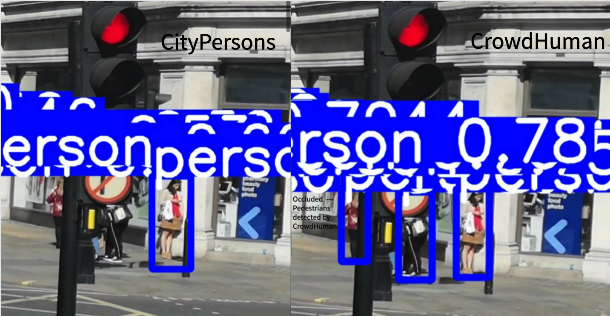
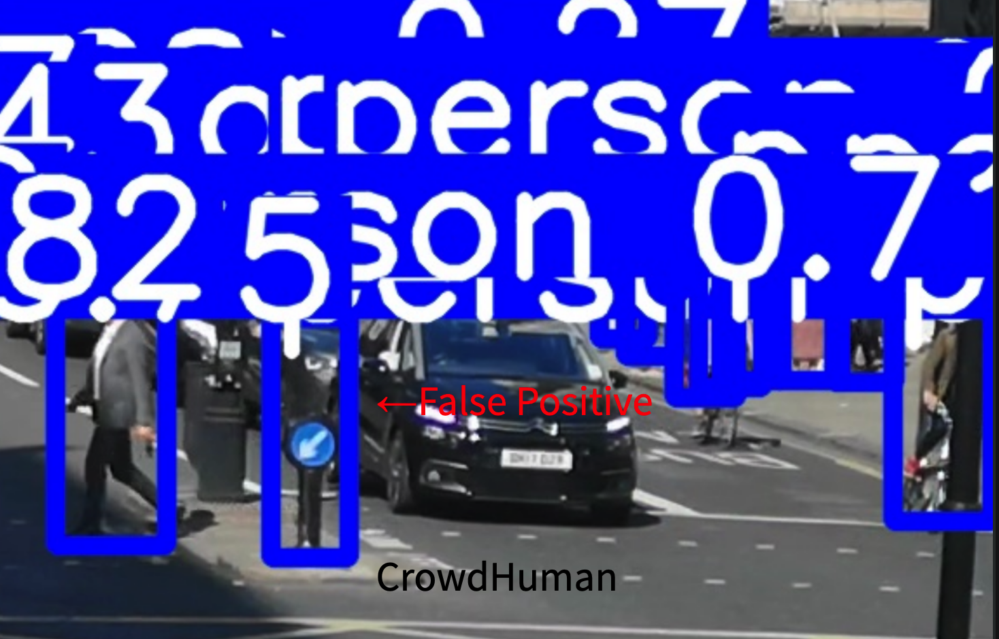
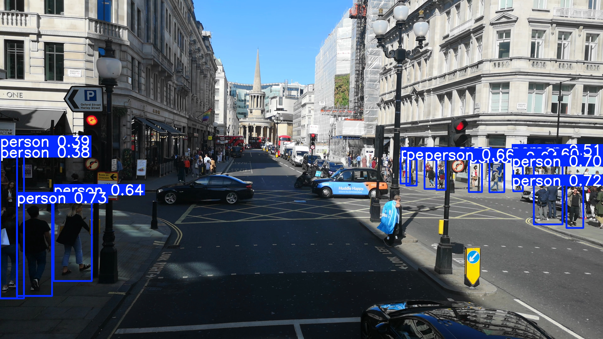
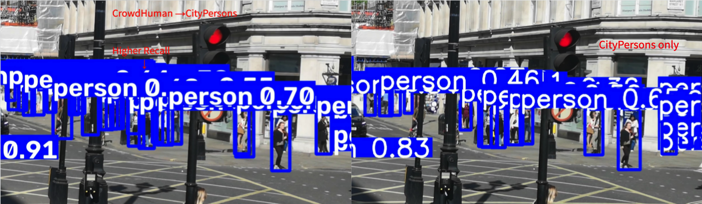
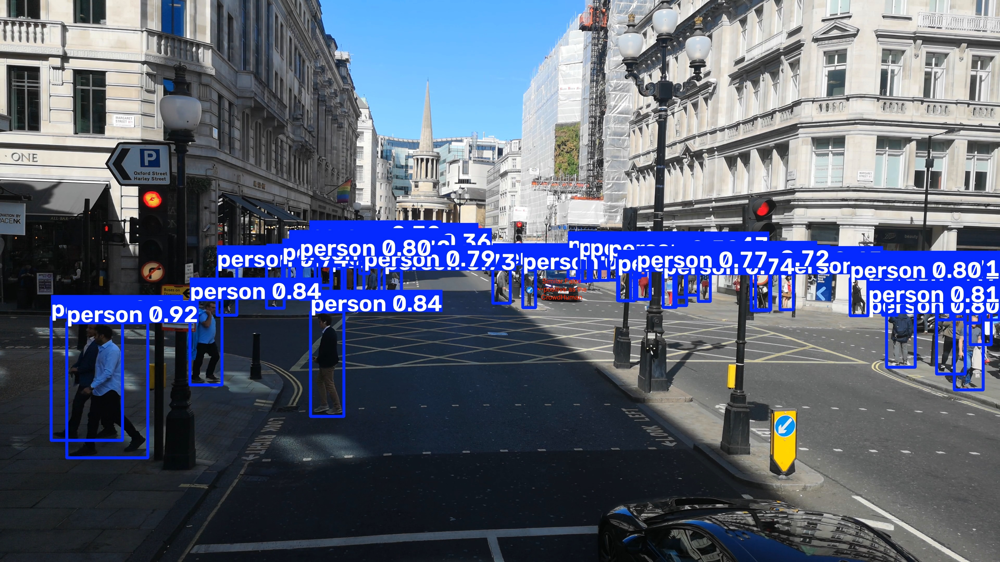
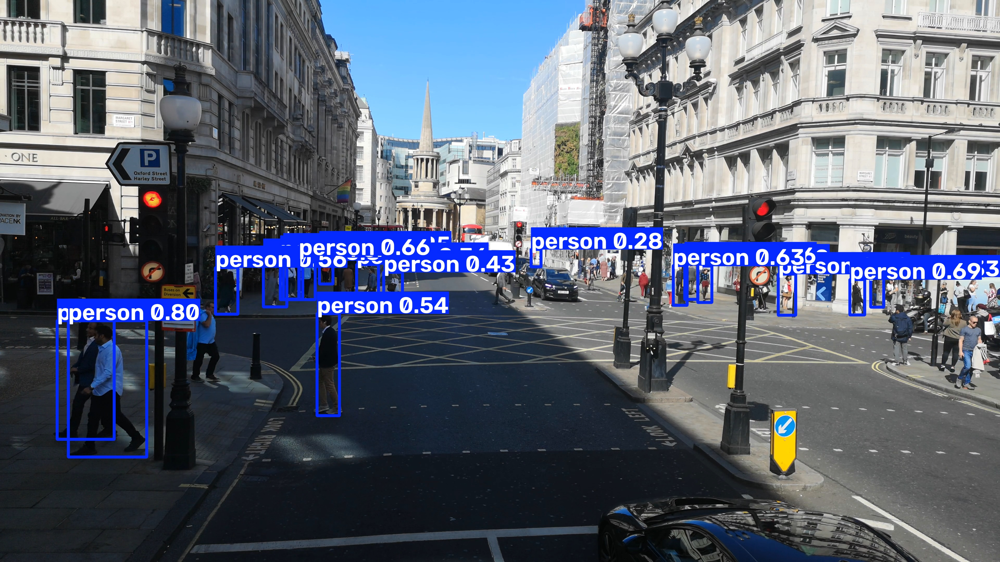

# Qualitative Analysis

This directory contains qualitative comparisons of the pedestrian-detection models on a shared set of video frames.

The purpose of this analysis is to complement the quantitative cross-dataset evaluation by examining **how different training strategies behave on specific challenging pedestrian-detection cases**, including:

* small and distant pedestrians;
* partial occlusion;
* missed detections;
* differences in apparent recall;
* false positives;
* and behavioral changes after sequential fine-tuning.

These examples are intended as **illustrative evidence**, not as a replacement for the quantitative evaluation reported in [`../cross_dataset_validation/`](../cross_dataset_validation/).

---

## Analysis Design

Three frames were selected from the same source video:

* **2 s**
* **7 s**
* **22 s**

The same extracted frame was provided independently to each model so that every detector was evaluated on identical image content.

The selected frames were chosen because they contain distinct challenging cases rather than because they produced uniformly favorable results for any particular model.

### Selected Cases

**2 s**

* multiple pedestrians at varying distances;
* partially occluded pedestrians;
* differences in the number of pedestrians detected;
* a CrowdHuman false-positive detection.

**7 s**

* a clearly visible pedestrian missed by the Caltech-only and CityPersons-only models but detected by the CrowdHuman-only model.

**22 s**

* a pedestrian substantially occluded by a streetlight pole;
* CrowdHuman-only successfully detects the pedestrian while CityPersons-only misses the instance.

---

# Single-Dataset Model Comparison

The first comparison examines the three independently trained models:

* **Caltech only**
* **CityPersons only**
* **CrowdHuman only**

These comparisons provide qualitative evidence for the main project question: how does the choice of training dataset affect behavior outside the original training domain?

## Occlusion Handling


In this example, the pedestrian is substantially obscured by a streetlight pole.

The **CrowdHuman-only model detects the partially occluded pedestrian**, while the **CityPersons-only model misses the instance**.

A similar pattern appears in another selected scene:



CrowdHuman detects additional pedestrians under partial occlusion that are not detected by CityPersons in the same scene.

These examples are consistent with the stronger CrowdHuman performance observed quantitatively across several cross-domain evaluations.

---

## False Positive Example

The increased sensitivity of the CrowdHuman model does not produce uniformly better predictions.



In this scene, CrowdHuman incorrectly classifies part of a street fixture as a pedestrian.

This example is retained deliberately to show that the model's stronger ability to detect difficult pedestrian instances can also coincide with erroneous detections.

The qualitative analysis therefore does not suggest that CrowdHuman is universally superior on every individual prediction.

---

## Caltech Behavior



The Caltech-only model showed visibly weaker behavior on these external scenes, particularly for:

* partially occluded pedestrians;
* distant pedestrians;
* and some otherwise clearly visible pedestrian instances.

These observations are consistent with the quantitative cross-dataset evaluation, where the Caltech-only model showed strong source-domain specialization but substantially weaker performance on other domains.

Because many of these failures are already evident in the full-frame predictions, additional detailed annotations were not produced for every Caltech comparison.

---

# Sequential-Transfer Comparison

The qualitative analysis also examines how sequential fine-tuning changed model behavior relative to training only on the final dataset.

The most informative comparison was:

## CityPersons only ↔ CrowdHuman → CityPersons



Two behaviors are visible in the comparison.

### Partial Retention of CrowdHuman-Like Behavior

The CrowdHuman → CityPersons model produces additional pedestrian detections and retains some ability to detect partially occluded pedestrians that are missed by the CityPersons-only model.

This is consistent with the quantitative evaluation, where CrowdHuman → CityPersons showed higher recall and stronger performance on CrowdHuman and BDD100K than CityPersons-only.

### Influence of the Final CityPersons Stage

Despite this retained behavior, the sequential model also misses some of the same small or difficult pedestrians missed by CityPersons-only.

The resulting detector therefore does not simply preserve CrowdHuman-only behavior after fine-tuning.

Instead, the selected examples suggest **partial retention of CrowdHuman-associated robustness alongside adaptation toward the final CityPersons domain**.

This provides a qualitative counterpart to the quantitative finding that transfer direction influenced the final model behavior.

## CityPersons → CrowdHuman

The **CityPersons → CrowdHuman** model was first trained on CityPersons and then fine-tuned on CrowdHuman.

Quantitatively, this model behaved almost identically to the CrowdHuman-only model across all evaluated domains. The qualitative predictions were therefore inspected to determine whether this similarity was also visible in individual scenes.



In the inspected frames, the model exhibited pedestrian-detection behavior very similar to the CrowdHuman-only model.

Notably, it also reproduced one of the same qualitative error patterns observed for CrowdHuman-only: a **false-positive pedestrian detection on the same scene/object region** used earlier in the single-dataset qualitative examples.


This is useful qualitative evidence because it suggests that the similarity between the two models is not limited to aggregate metrics alone. Instead, the **CityPersons → CrowdHuman** model appears to have adopted much of the behavioral signature of the final CrowdHuman training stage, including both:

* stronger sensitivity to difficult pedestrian instances; and
* at least some of the same false-positive tendencies.

This observation is consistent with the cross-dataset results, where CityPersons → CrowdHuman and CrowdHuman-only achieved nearly identical performance:

| Evaluation Domain      | CrowdHuman Only | CityPersons → CrowdHuman |
| ---------------------- | --------------: | -----------------------: |
| Caltech Test           |           0.199 |                    0.194 |
| CityPersons Validation |           0.286 |                    0.283 |
| CrowdHuman Validation  |           0.563 |                    0.559 |
| BDD100K Validation     |           0.246 |                    0.245 |

Taken together, the quantitative and qualitative evidence suggests that **the later CrowdHuman fine-tuning stage largely dominated the earlier CityPersons stage under this training setup**.

This should not be interpreted as evidence that sequential training from a smaller to a larger dataset is ineffective in general; rather, it indicates that under this particular configuration, the final CrowdHuman stage strongly shaped the resulting detector behavior.


---

## Caltech → CityPersons

The **Caltech → CityPersons** model was first trained on Caltech and subsequently fine-tuned on CityPersons.

This experiment was included to determine whether prior Caltech training provided a useful initialization before adapting the detector to the CityPersons domain.



The model was qualitatively inspected on the same selected frames used for the other detectors.

Unlike CrowdHuman → CityPersons, the Caltech → CityPersons sequence did not produce a strong positive transfer result in the quantitative evaluation. On CityPersons validation, it achieved:

```text
CityPersons only          0.380 mAP50–95
Caltech → CityPersons     0.324 mAP50–95
```

Its performance on the independent BDD100K evaluation was slightly higher than CityPersons-only:

```text
CityPersons only          0.190 mAP50–95
Caltech → CityPersons     0.201 mAP50–95
```

However, the overall evaluation does not provide evidence that prior Caltech training consistently improved the resulting CityPersons detector.

For this reason, the raw prediction is retained as a qualitative example without additional detailed annotation. The experiment serves primarily as a contrasting transfer outcome to the other sequential-training strategies.

---

## Sequential-Training Summary

Taken together, the three transfer experiments produced substantially different outcomes:

* **CityPersons → CrowdHuman:** became nearly indistinguishable from CrowdHuman-only, suggesting strong influence from the final CrowdHuman stage.
* **CrowdHuman → CityPersons:** retained some CrowdHuman-associated behavior while adapting toward CityPersons, including higher recall and some improved handling of occluded pedestrians.
* **Caltech → CityPersons:** did not improve overall CityPersons performance relative to CityPersons-only under the evaluated setup.

The qualitative comparisons therefore reinforce the broader finding that **the effect of sequential fine-tuning depends strongly on both the source dataset and the direction of transfer**.


---

# Interpretation

The selected examples support three observations from the broader evaluation.

1. **Training domain affects the kinds of pedestrian instances a model handles successfully.**
   CrowdHuman-only more consistently detects challenging pedestrians involving distance and occlusion in the selected scenes.

2. **Improved sensitivity can introduce additional errors.**
   CrowdHuman also produces a false-positive detection in one selected case, showing that stronger recall on difficult instances does not imply error-free behavior.

3. **Sequential fine-tuning can preserve some earlier-domain behavior without preserving it completely.**
   CrowdHuman → CityPersons retains some CrowdHuman-like sensitivity to occluded pedestrians while also developing failure patterns similar to CityPersons-only.

These observations complement, rather than establish, the project's quantitative conclusions.

---

# Directory Structure

```text
qualitative/
├── README.md
│
├── frames/
│   ├── time_2s.png
│   ├── time_7s.png
│   └── time_22s.png
│
├── selected/
│   ├── single_dataset/
│   │   ├── frame_02s_false_positive.png
│   │   ├── frame_02s_occlusion.png
│   │   └── frame_22s_occlusion.png
│   │
│   └── transfer/
│       ├── crowdhuman_to_citypersons_vs_citypersons_frame_02s.png
│       └── crowdhuman_vs_citypersons_to_crowdhuman_frame_02s.png
│
├── single_dataset_predictions/
│   ├── caltech/
│   ├── citypersons/
│   └── crowdhuman/
│
└── transfer_predictions/
    ├── caltech_to_citypersons/
    ├── citypersons_to_crowdhuman/
    └── crowdhuman_to_citypersons/
```

## `frames/`

Contains the clean extracted source frames used as common inputs to the models.

These images are preserved separately from model predictions and annotations.

## `single_dataset_predictions/`

Contains the unedited predictions from the three independently trained models:

* Caltech only
* CityPersons only
* CrowdHuman only

## `transfer_predictions/`

Contains the unedited outputs produced by the sequential-transfer models.

These files preserve the original model predictions before qualitative cropping or annotation.

## `selected/`

Contains the curated figures used in the qualitative analysis.

These images may include:

* aligned side-by-side comparisons;
* identical spatial crops;
* arrows or labels identifying important regions;
* annotations for occlusion, missed detections, or false positives.

The annotations are presentation aids only. The original model-generated predictions remain preserved separately.

---

# Scope and Limitations

This qualitative analysis uses a small number of deliberately selected frames to illustrate behaviors observed during model inspection.

The examples should therefore **not be interpreted as statistical evidence that one model always performs better on a particular type of pedestrian instance**.

The project's quantitative conclusions are based on the complete cross-dataset evaluation across Caltech, CityPersons, CrowdHuman, and BDD100K.

The qualitative examples serve a different purpose: they provide concrete visual examples of behaviors that aggregate metrics alone cannot fully communicate.

## Source Video

The qualitative analysis uses an external urban street video from Pexels:

[People and Vehicles on the Streets during Daytime](https://www.pexels.com/video/people-and-vehicles-on-the-streets-during-daytime-2954065/)

The video was used only for qualitative model inspection and was not part of the project training or evaluation datasets.

---